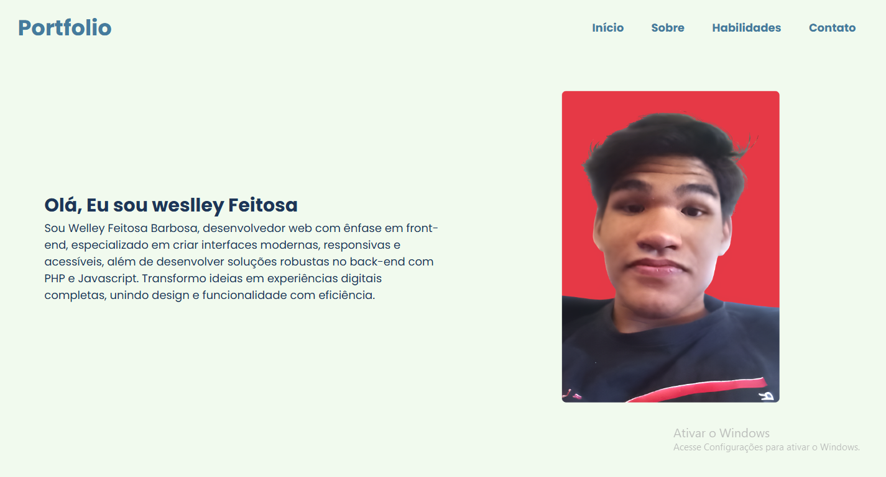
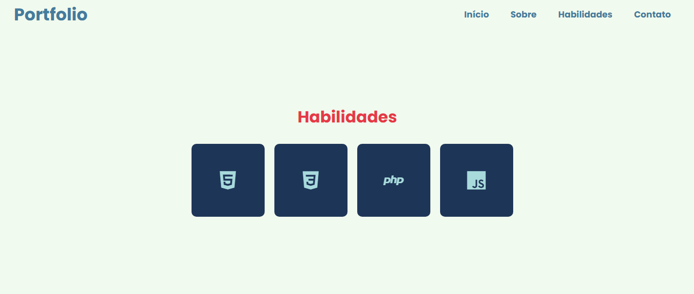

# Portfólio
Meu portifolio 🧑‍💻

    <h2>Acesse o portfólio pelo QRcode </h2>
    
    <h2>Sesão principal 📂</h2>
    
     
    <h2>Sesão Sobre mim 🙋‍♂️</h2>
    
     
    <h2>Sesão Habilidades 🚀</h2>
    
     
    <h2>Sesão Contatos 📱</h2>
    
     

